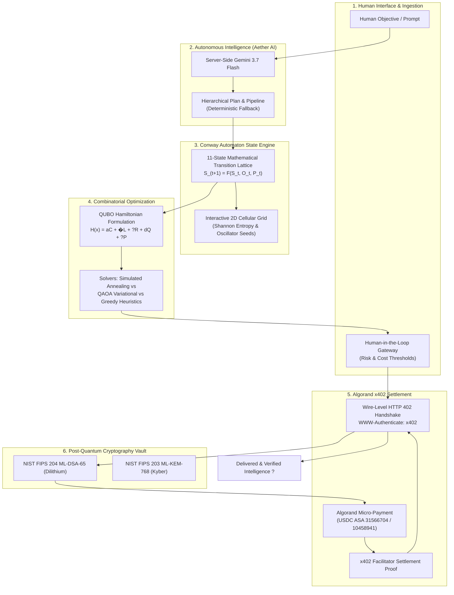

# SHOR x402 � Post-Quantum Autonomous Agent Commerce on Algorand

[](https://algorand.co)
[-7C3AED)](https://csrc.nist.gov/pubs/fips/204/final)
[](https://x402.org)
[](https://aistudio.google.com)
[](LICENSE)
[](https://app.netlify.com/start/deploy?repository=https://github.com/elon00/shor-x402)

> **SHOR x402** is a quantum-resilient, autonomous economic protocol and agent commerce command hub built natively on the **Algorand Blockchain**. It unifies **Hierarchical AI Task Planning (Gemini / Aether AI)**, **11-State Conway Cellular Automaton State Transitions**, **QUBO/QAOA Combinatorial Service Optimization**, **Wire-Level HTTP 402 Machine-to-Machine Settlements**, and **NIST FIPS 203/204 Post-Quantum Cryptography (ML-DSA-65 & ML-KEM-768)** into a production-grade Web 4.0 operating platform.

---

## ?? Table of Contents

1. [Architectural Overview](#-architectural-overview)
2. [The 6 Core Subsystems](#-the-6-core-subsystems)
3. [Mathematical Formulations](#-mathematical-formulations)
4. [x402 Wire-Level Protocol Specification](#-x402-wire-level-protocol-specification)
5. [????? ??? ???????? ???????????? (Hindi Architecture Deep Dive)](#-?????-???-????????-????????????-hindi-architecture-deep-dive)
6. [Pre-Seeded Digital Services Catalog](#-pre-seeded-digital-services-catalog)
7. [Getting Started & Local Development](#-getting-started--local-development)
8. [Deployment to Netlify & Cloud](#-deployment-to-netlify--cloud)
9. [Algorand MainNet & TestNet Setup](#-algorand-mainnet--testnet-setup)
10. [Repository Structure](#-repository-structure)
11. [Security, Governance & Circuit Breakers](#-security-governance--circuit-breakers)

---

## ??? Architectural Overview



---

## ? The 6 Core Subsystems

### 1. Autonomous Agent Command Hub
- **Natural-Language Goal Dispatcher**: Accepts high-level human objectives and triggers hierarchical task decomposition using server-side Gemini 3.7 Flash intelligence with deterministic failover.
- **Live Execution Plan & Pipeline**: Tracks step-by-step progress across observation, QUBO service discovery, governance policy checks, x402 negotiations, Algorand payment broadcasting, and cryptographic receipt verification.
- **Human-in-the-Loop Gateway**: Implements interactive approval checkpoints whenever task costs exceed `$0.03 USDC` or risk ratings exceed `0.25`.

### 2. Conway Automaton State Engine
- **State Transition Lattice**: Models autonomous agent execution through **11 discrete mathematical states**:
  $$\text{S0\_IDLE} \rightarrow \text{S1\_OBSERVE} \rightarrow \text{S2\_PLAN} \rightarrow \text{S3\_DISCOVER} \rightarrow \text{S4\_EVALUATE} \rightarrow \text{S5\_AUTHORIZE} \rightarrow \text{S6\_PAY} \rightarrow \text{S7\_EXECUTE} \rightarrow \text{S8\_VERIFY} \rightarrow \text{S9\_RECOVER} \rightarrow \text{S10\_COMPLETE}$$
- **Interactive Cellular Canvas**: Evolves a real-time 2D Conway grid alongside agent state changes with live computation of Shannon entropy, active cells, generation counts, and dynamic pattern injection (Gliders, LWSS, Pulsars, Beacons, Pentadecathlons).

### 3. QUBO / QAOA Service Selection Optimizer
- **Hamiltonian Energy Formulation**: Solves combinatorial service provider selection considering cost, latency, risk, post-quantum security, and budget penalty constraints.
- **Interactive Parameter Tuners**: Live sliders for cost ($\alpha$), latency ($\beta$), risk ($\gamma$), PQC security ($\delta$), and policy penalties ($\lambda$).
- **Matrix & Energy Landscape Visualizer**: Displays the upper-triangular $Q$ matrix alongside energy comparisons between Simulated Annealing, QAOA Quantum Ansatz simulation, and Greedy heuristics.

### 4. Algorand x402 Settlement & HTTP 402 Inspector
- **Real HTTP 402 Handshake**: Wire-level standard HTTP 402 negotiation (`GET` $\rightarrow$ `402 Payment Required` with `WWW-Authenticate: x402` and `X-402-Cost` $\rightarrow$ on-chain Algorand micro-payment $\rightarrow$ signed proof token $\rightarrow$ `200 OK` delivery).
- **On-Chain Ledger & Packet Trace**: Real-time round streaming, transaction detail inspection, and HTTP packet logging.

### 5. Post-Quantum Cryptography (PQC) Vault
- **NIST FIPS 203 & 204 Standardized**: Supports **ML-DSA-65** (Dilithium) digital signatures and **ML-KEM-768** (Kyber) key encapsulation for crypto-agility against quantum cryptanalysis.
- **Interactive Keypair Rotator & Benchmark**: Live keypair generation with sub-millisecond lattice signing and verification benchmarks.

### 6. Decentralized Service Registry & Governance
- Pre-seeded with real machine-payable services (Weather Radar, Quantum Inference, Orbital HPC, Market Intelligence, Quantum Entropy).
- Sandbox tester for raw execution, custom endpoint registration portal, spending caps, daily limits, and an emergency circuit breaker kill-switch.

---

## ?? Mathematical Formulations

### 1. QUBO Service Selection Hamiltonian

$$\mathcal{H}(x) = \alpha \sum_{i} \mu_i x_i + \beta \sum_{i} \ell_i x_i + \gamma \sum_{i} \mathcal{R}_i x_i + \delta \sum_{i} (1 - \mathcal{Q}_i) x_i + \lambda \left( \sum_{i} x_i - 1 \right)^2 + \mathcal{P}_{\text{budget}}(x)$$

Where:
- $x_i \in \{0, 1\}$: Binary decision variable indicating whether service $i$ is selected.
- $\mu_i$: Normalized payment cost of service $i$.
- $\ell_i$: Normalized latency of service $i$.
- $\mathcal{R}_i$: Normalized operational risk score of service $i$.
- $\mathcal{Q}_i$: Post-quantum security score ($\mathcal{Q}_i \in [0, 1]$).
- $\alpha, \beta, \gamma, \delta, \lambda$: User-tunable Hamiltonian weight coefficients.
- $\lambda \left(\sum_i x_i - 1\right)^2$: Quadratic penalty enforcing exact single-service selection.

### 2. Conway Automaton State Lattice Evolution

$$S_{t+1} = \mathcal{F}(S_t, \mathcal{O}_t, \mathcal{P}_t)$$

Where:
- $S_t \in \{S_0, S_1, \dots, S_{10}\}$: Current discrete agent execution state.
- $\mathcal{O}_t$: Environment observation vector (HTTP headers, node status, provider responses).
- $\mathcal{P}_t$: Active governance policy limits.
- $\mathcal{F}$: Deterministic state transition mapping.

### 3. Shannon Entropy of State Lattice

$$\mathcal{H}(X) = - \sum_{i=1}^n p_i \log_2 (p_i) = - p_{\text{live}} \log_2 (p_{\text{live}}) - (1 - p_{\text{live}}) \log_2 (1 - p_{\text{live}})$$

Where $p_{\text{live}} = \frac{N_{\text{active}}}{N_{\text{total\_cells}}}$ is the proportion of active cells in the cellular automaton.

---

## ?? x402 Wire-Level Protocol Specification

```
[Agent Client]                                       [x402 Paid Service]          [x402 Facilitator]
      �                                                      �                             �
      � --- 1. GET /api/services/weather ------------------> �                             �
      �                                                      �                             �
      � <-- 2. HTTP 402 Payment Required ------------------- �                             �
      �        WWW-Authenticate: x402 realm="shor"           �                             �
      �        X-402-Cost-USDC: 0.002                        �                             �
      �        X-402-Recipient: WEATHR7Q...                  �                             �
      �        X-402-Nonce: x402_nonce_8f3a92b               �                             �
      �        X-402-PQC-Standard: FIPS-204-ML-DSA-65        �                             �
      �                                                      �                             �
      � --- 3. Post-Quantum Hybrid Sign (ML-DSA-65) -------- � ----------- [Algorand Ledger]
      �        Broadcast Micro-payment on Algorand           �                             �
      �                                                                                    �
      � --- 4. POST /api/x402/verify-payment (txId, nonce) ------------------------------> �
      � <-- 5. Signed Settlement Proof Token --------------------------------------------- �
      �                                                      �                             �
      � --- 6. GET /api/services/weather ------------------> �                             �
      �        Authorization: x402-algo <proof_token>        �                             �
      �        X-Algorand-TxId: <tx_id>                      �                             �
      �        X-PQC-Signature: <ml_dsa_sig>                 �                             �
      �                                                      �                             �
      � <-- 7. HTTP 200 OK + Verified JSON Payload --------- �                             �
```

---

## ???? ????? ??? ???????? ???????????? (Hindi Architecture Deep Dive)

### SHOR x402 ???? ???
**SHOR x402** ?? ??? Web 4.0 AI Agent System ?? ?????? ??????? ??????????? (AI) ???? ???? ?? ??????? ???? ???? ???????? ?? ????? ??????? ?? ????? ????????? ??? APIs ?? ???????? ?? ????? ??, ???? ???? ?? ??????? ?? ??????? ????????????? ???? ??, **Algorand ????????** ?? **x402 (HTTP 402)** ????????? ?? ???? ???????-?????? ???? ??, ?? ?????-??????? ??????????????? ?????????? ?? ??? ?????? ???? ?????? ???

### ???? ????? ?????:
1. **AI ????? ?? (Gemini 3.7 Flash)**: ?? ??????? ?????/???????? ??? ???????? ???? ??? (????: *"???? ?????? ?? ???? ???? ???????? API ?? ?????"*), ?? AI ??? ????? ???? ????? ??? ?????? ????????? ???? ???
2. **????? ??????? (11 ???????)**: ????? ?? ?? ??? ?? ???????? ?????? ?????? (`IDLE` $\rightarrow$ `OBSERVE` $\rightarrow$ `PLAN` $\rightarrow$ `DISCOVER` $\rightarrow$ `EVALUATE` $\rightarrow$ `AUTHORIZE` $\rightarrow$ `PAY` $\rightarrow$ `EXECUTE` $\rightarrow$ `VERIFY` $\rightarrow$ `RECOVER` $\rightarrow$ `COMPLETE`) ??? ???? ??, ???? 2D ?????? ?? ???? ????????? ?? ???? ????-???? ???? ?? ???? ???
3. **QUBO / QAOA ???????????**: ???? ?????, ???? ??? ?? ???? ???????? API ????? ?? ??? ??????????? ?????? ($H(x)$) ?? ???? ???? ???
4. **Algorand x402 ????????**: HTTP 402 ????????? ?? ??? ????-????? ??????? ?? $0.001 ALGO ??????????? ??? ?? ??? USDC ???????-???????
5. **PQC ????? (NIST FIPS 203/204)**: ?????? ?? ??????? ?????????? ?? ????? ?? ??????? ?? ??? **ML-DSA-65** ?? **ML-KEM-768** ????? ???????????

---

## ?? Pre-Seeded Digital Services Catalog

| Service ID | Service Name | Endpoint | Cost (USDC) | Latency | Risk | PQC Standard |
| :--- | :--- | :--- | :--- | :--- | :--- | :--- |
| `srv-weather-hyperlocal` | Planetary Radar & Weather | `/api/services/weather` | `$0.002` | 145 ms | Low (0.05) | ML-DSA-65 (0.95) |
| `srv-quantum-inference` | Quantum Neural Inference | `/api/services/quantum-inference` | `$0.015` | 380 ms | Med (0.15) | ML-KEM-768 (0.99) |
| `srv-hpc-satellite` | Distributed Orbital GIS | `/api/services/satellite-compute` | `$0.050` | 890 ms | Med (0.20) | ML-DSA-65 (0.90) |
| `srv-market-intelligence` | Institutional Macro Feed | `/api/services/market-intelligence` | `$0.008` | 95 ms | Low (0.08) | ML-DSA-65 (0.92) |
| `srv-pqc-entropy` | True Quantum Entropy Seed | `/api/services/pqc-entropy` | `$0.001` | 45 ms | Zero (0.01) | ML-KEM-768 (1.00) |

---

## ?? Getting Started & Local Development

### Prerequisites
- **Node.js**: v20.x or v22.x LTS
- **npm** or **pnpm**
- **Git**

### Installation

```bash
# 1. Clone the repository
git clone https://github.com/elon00/shor-x402.git
cd shor-x402

# 2. Install dependencies
npm install

# 3. Setup environment variables
cp .env.example .env
```

### Configure `.env`
Edit your `.env` file to add your Gemini API key:
```env
GEMINI_API_KEY="your_gemini_api_key_here"
PORT=3000
```

### Run Locally
```bash
# Start full development server (Frontend + x402 Server + Gemini Agent)
npm run dev
```
Open [http://localhost:3000](http://localhost:3000) in your browser.

---

## ?? Deployment to Netlify & Cloud

### One-Click Netlify Deployment

This repository includes pre-configured **Netlify Serverless Functions** (`netlify/functions/api.ts`) and `netlify.toml`.

1. Fork or push this repository to GitHub.
2. Log into [Netlify](https://app.netlify.com) and click **"Add new site"** $\rightarrow$ **"Import an existing project"**.
3. Select your `shor-x402` repository.
4. Netlify will auto-detect settings from `netlify.toml`:
   - **Build Command**: `npm run build`
   - **Publish Directory**: `dist`
   - **Functions Directory**: `netlify/functions`
5. In **Site Configuration** $\rightarrow$ **Environment Variables**, add:
   - `GEMINI_API_KEY`: *(Your Google AI Studio API Key)*
6. Click **Deploy Site**!

### Production Node Server Build
```bash
# Build Vite SPA bundle and compiled CJS server
npm run build

# Start production server
npm start
```

---

## ?? Algorand MainNet & TestNet Setup

SHOR x402 supports zero-configuration connectivity via free public **AlgoNode** infrastructure:

- **Algorand MainNet Algod**: `https://mainnet-api.algonode.cloud`
- **Algorand MainNet USDC ASA**: `31566704`
- **Algorand TestNet Algod**: `https://testnet-api.algonode.cloud`
- **Algorand TestNet USDC ASA**: `10458941`
- **Block Explorers**: [Allo.info](https://allo.info) & [Pera Explorer](https://explorer.perawallet.app)

---

## ?? Repository Structure

```
shor-x402/
+-- .github/
�   +-- workflows/
�       +-- ci.yml                    # CI Lint, Typecheck & Build Matrix
�       +-- deploy.yml                # Automated Netlify Production Deploy
�       +-- algorand-validation.yml   # Algorand Node & Security Check
+-- netlify/
�   +-- functions/
�       +-- api.ts                    # Netlify Serverless API & x402 Handler
+-- src/
�   +-- components/
�   �   +-- AgentCommandHub.tsx       # AI Dispatcher & Live Plan Execution
�   �   +-- AlgorandExplorerView.tsx  # On-Chain Ledger & HTTP 402 Packet Trace
�   �   +-- ConwayAutomatonView.tsx   # 11-State Cellular Automaton & Entropy
�   �   +-- GovernanceView.tsx        # Policy Engine & Circuit Breaker
�   �   +-- Header.tsx                # Wallet, PQC Key & Network Bar
�   �   +-- PqcSecurityView.tsx       # NIST FIPS 203/204 Vault & Benchmark
�   �   +-- QuboSolverView.tsx        # Hamiltonian Matrix & Solver Visualizer
�   �   +-- ServiceMarketplaceView.tsx# Service Catalog & Sandbox Tester
�   +-- data/
�   �   +-- serviceRegistry.ts        # Pre-seeded x402 Services Catalog
�   +-- services/
�   �   +-- algorandClient.ts         # Live Algod Node Status & Explorer
�   �   +-- apiClient.ts              # Client x402 Negotiation & Packet Logger
�   +-- utils/
�   �   +-- conwayEngine.ts           # 2D Grid Engine, Step & Entropy
�   �   +-- pqcCrypto.ts              # ML-DSA-65 & ML-KEM-768 Generator/Signer
�   �   +-- quboSolver.ts             # QUBO Matrix & Annealing Solver
�   +-- App.tsx                       # Main Application State & Coordinator
�   +-- main.tsx                      # React 19 Root Entrypoint
�   +-- types.ts                      # Protocol Types & Interface Definitions
+-- .env.example                      # Environment variables template
+-- netlify.toml                      # Netlify Build & Serverless Routing Config
+-- package.json                      # Dependencies & NPM Scripts
+-- server.ts                         # Standalone Express Server with x402 & Gemini
+-- tsconfig.json                     # Strict TypeScript Configuration
+-- vite.config.ts                    # Vite & Tailwind CSS v4 Configuration
```

---

## ??? Security, Governance & Circuit Breakers

- **Human-in-the-Loop Thresholds**: Autonomous execution halts and requests manual confirmation if single request cost $> \$0.03\text{ USDC}$ or provider risk rating $> 0.25$.
- **Emergency Circuit Breaker**: One-click kill switch to instantly freeze all automated payments and settlement dispatches.
- **Spending Caps**: Strict daily budget limits ($2.50 USDC default) with hard transaction caps ($0.06 USDC per request).
- **Post-Quantum Agility**: Modular cryptographic signatures allowing drop-in upgrades as NIST finalizes additional post-quantum standards.

---

## ?? License

Distributed under the **Apache-2.0 License**. See `LICENSE` for more information.

---

**SHOR x402** � *Pioneering the Post-Quantum Autonomous Machine Economy on Algorand.*
