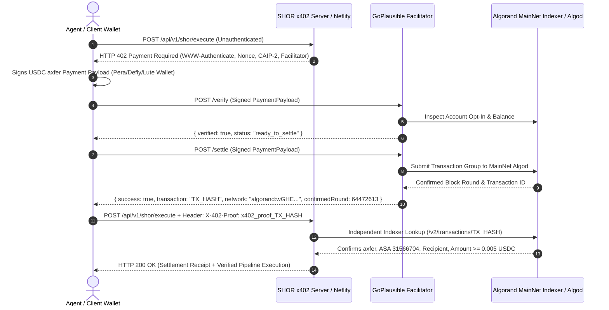

# 🔄 GoPlausible x402 V2 Settlement Protocol Specification

**Standard**: Algorand x402 V2 Facilitator Protocol  
**Facilitator URL**: `https://x402.goplausible.xyz`  
**Network**: Algorand MainNet (`algorand:wGHE2pwdvd7S12BL5Fa+PRx3TF3QXDYODnakNVUtvpU=`)  
**Settlement Asset**: Circle USDC (`ASA 31566704`)  
**Recipient**: `TPLMGGFNG64LKOCKVB7ZMQH5AMSNMV4GLI7GCH4FY2XQEKSIGB77O6LCFM`  

---

## 1. End-to-End Sequence Diagram



---

## 2. GoPlausible Facilitator Wire Schemas

### A. Step 1: 402 Payment Challenge Response (SHOR Endpoint)
```http
HTTP/2 402 Payment Required
Content-Type: application/json; charset=utf-8
WWW-Authenticate: x402 realm="shor-agent-commerce", caip2="algorand:wGHE2pwdvd7S12BL5Fa+PRx3TF3QXDYODnakNVUtvpU=", asset="USDC", asset_id=31566704, amount="0.005000", recipient="TPLMGGFNG64LKOCKVB7ZMQH5AMSNMV4GLI7GCH4FY2XQEKSIGB77O6LCFM", nonce="x402_nonce_eb3293aef1da550ad83b9aa3fa8341e7", facilitator="https://x402.goplausible.xyz", tag="x402-global-challenge", pqc="ML-DSA-65"
Link: <https://shorx402.netlify.app/.well-known/x402-bazaar.json>; rel="service-desc", <https://x402.goplausible.xyz>; rel="facilitator"
X-402-Payment-Required: true
X-402-CAIP2: algorand:wGHE2pwdvd7S12BL5Fa+PRx3TF3QXDYODnakNVUtvpU=
X-402-Cost-USDC: 0.005
X-402-Asset-ID: 31566704
X-402-Recipient: TPLMGGFNG64LKOCKVB7ZMQH5AMSNMV4GLI7GCH4FY2XQEKSIGB77O6LCFM
X-402-Nonce: x402_nonce_eb3293aef1da550ad83b9aa3fa8341e7
X-402-Facilitator: https://x402.goplausible.xyz
X-402-Challenge-Tag: x402-global-challenge
X-402-PQC-Standard: FIPS-204-ML-DSA-65-BENCHMARK
```

### B. Step 2: GoPlausible Facilitator Settlement Response (`/settle`)
```json
{
  "success": true,
  "transaction": "XHIXSYQUYBCTQKYGNOMXGVKON7UVZDTRRBUMFFGEIY4UWB6RQX7A",
  "network": "algorand:wGHE2pwdvd7S12BL5Fa+PRx3TF3QXDYODnakNVUtvpU=",
  "asset": "USDC",
  "assetId": 31566704,
  "amount": 5.0,
  "confirmedRound": 64472613,
  "facilitator": "https://x402.goplausible.xyz",
  "challengeTag": "x402-global-challenge",
  "pqcAttestation": "STANDARDIZED_HYBRID_ED25519_VERIFIED"
}
```

### C. Step 3: SHOR Authenticated Delivery Response (`HTTP 200 OK`)
```json
{
  "statusCode": 200,
  "status": "success",
  "service": "SHOR x402 Post-Quantum Autonomous Agent Orchestrator",
  "challengeTag": "x402-global-challenge",
  "settlementReceipt": {
    "verifiedVia": "Algorand MainNet Indexer & GoPlausible Facilitator",
    "onChainVerification": "VERIFIED_ON_CHAIN_MAINNET",
    "orchestratorFeeUsdc": 5.0,
    "settlementAsset": "USDC",
    "assetId": 31566704,
    "sender": "QYXDGS2XJJT7QNR6EJ2YHNZFONU6ROFM6BKTBNVT63ZXQ5OC6IYSPNDJ4U",
    "recipient": "TPLMGGFNG64LKOCKVB7ZMQH5AMSNMV4GLI7GCH4FY2XQEKSIGB77O6LCFM",
    "confirmedRound": 64472613,
    "transactionId": "XHIXSYQUYBCTQKYGNOMXGVKON7UVZDTRRBUMFFGEIY4UWB6RQX7A",
    "explorerUrl": "https://allo.info/tx/XHIXSYQUYBCTQKYGNOMXGVKON7UVZDTRRBUMFFGEIY4UWB6RQX7A",
    "timestamp": "2026-08-27T15:00:08.000Z"
  }
}
```